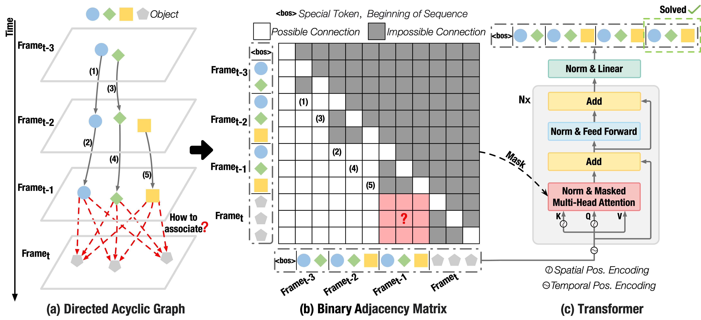

# PuTR: A Pure Transformer for Decoupled and Online Multi-Object Tracking


## Abstract
Recent advances in Multi-Object Tracking (MOT) have achieved remarkable success in short-term association within the decoupled tracking-by-detection online paradigm. However, long-term tracking still remains a challenging task. Although graph-based approaches can address this issue by modeling trajectories as a graph in the decoupled manner, their non-online nature poses obstacles for real-time applications. In this paper, we demonstrate that the trajectory graph is a directed acyclic graph, which can be represented by an object sequence arranged by frame and a binary adjacency matrix. It is a coincidence that the binary matrix matches the attention mask in the Transformer, and the object sequence serves exactly as a natural input sequence. Intuitively, we propose that a pure Transformer can naturally unify short- and long-term associations in a decoupled and online manner. Our experiments show that a classic Transformer architecture naturally suits the association problem and achieves a strong baseline compared to existing foundational methods across four datasets: DanceTrack, SportsMOT, MOT17, and MOT20, as well as superior generalizability in domain shift. Moreover, the decoupled property also enables efficient training and inference. This work pioneers a promising Transformer-based approach for the MOT task, and provides code to facilitate further research.



## Installation

```shell
conda create -n PuTR python=3.10  # create a virtual env
conda activate PuTR               # activate the env
conda install pytorch torchvision torchaudio pytorch-cuda=11.8 -c pytorch -c nvidia
# The PyTorch version must be greater than 2.0.
conda install matplotlib pyyaml scipy tqdm tensorboard
pip install opencv-python lap
```

## Data
Download [DanceTrack](https://dancetrack.github.io/), [SportsMOT](https://github.com/MCG-NJU/SportsMOT)
, [MOT17](https://motchallenge.net/data/MOT17/), and [MOT20](https://motchallenge.net/data/MOT20/) datasets. In addition, prepare seqmaps to run evaluation (for details see [TrackEval](https://github.com/JonathonLuiten/TrackEval)). Overall, the expected folder structure is: 

```
DATA_ROOT/
  ├── DanceTrack/
  │ ├── train/
  │ ├── val/
  │ ├── test/
  │ └── val_seqmap.txt
  │
  ├── SportsMOT/
  │ ├── train/
  │ ├── val/
  │ ├── test/
  │ └── val_seqmap.txt
  │
  ├── MOT17/
  │ ├── train/
  │ └── test/
  │
  └── MOT20/
    ├── train/
    └── test/
```
Download [our detections](https://www.dropbox.com/scl/fi/usaoubca5to6jyd6e3a57/datasets.zip?rlkey=yoyf3e6aqsea06p4sotvq8mng&st=19cdokxy&dl=0) and [pretrained models](https://www.dropbox.com/scl/fi/9uyp4yy7z2yqr3of6od34/weights.zip?rlkey=0xnerp1u9dp09wh9evc1d57qf&st=2iqwze4s&dl=0) and arrange them according to the expected file structure.

## Training
Training PuTR only needs a single GPU (recommended to use GPU with >= 24 GB Memory, like RTX 4090 or some else).

For example, to train on DanceTrack:
```shell
python main.py --config-path ./configs/train_dancetrack_putr.yaml --data-root <your data dir path>
```
To train on other datasets, you can replace the `--config-path` in the above command. E.g., from `./configs/train_dancetrack_putr.yaml` to `./configs/train_sportsmot_putr.yaml` for training on SportsMOT, `./configs/train_mot17_putr.yaml` for training on MOT17, `./configs/train_mot20_putr.yaml` for training on MOT20, or `./configs/train_mix_putr.yaml` for training PuTR on the combination of DanceTrack, SportsMOT, MOT17, and MOT20.

## Inference
You can use this script to evaluate the trained model on the DanceTrack test set:
```shell
python main.py --config-path ./configs/eval_dancetrack_putr.yaml --data-root <your data dir path> --submit-model <filename of the checkpoint> --submit-data-split test
```
If you want to evaluate the model on the validation set, you can replace `test` with `val`.

To test on other datasets, you can replace the `--config-path` in the above command. E.g., from `./configs/eval_dancetrack_putr.yaml` to `./configs/eval_sportsmot_putr.yaml` for testing on SportsMOT, `./configs/eval_mot17_putr.yaml` for testing on MOT17, `./configs/eval_mot20_putr.yaml` for testing on MOT20.

## Results

### Multi-Object Tracking on the DanceTrack test set


| Methods   | IDF1 | HOTA | MOTA   |
| --------- |------|------|--------|
| PuTR      | 58.2 | 55.8 | 91.9   | 


### Multi-Object Tracking on the SportsMOT test set
*Train+Val and Train are the different detection results from YOLOX, and the results are obtained by the [official weights](https://github.com/MCG-NJU/MixSort).*

| Methods      | IDF1 | HOTA     | MOTA |
|--------------| ---- |----------|------| 
| PuTR (Train+Val) | 75.9| 74.9| 97.0 | 
| PuTR (Train) | 74.2|73.0| 95.1 | 


### Multi-Object Tracking on the MOT17 test set

| Methods | IDF1 | HOTA       | MOTA  |
| ------- | ---- |------------|-------|
| PuTR | 74.9|  61.7|  78.5 |

### Multi-Object Tracking on the MOT20 test set

| Methods | IDF1 | HOTA       | MOTA  |
| ------- | ---- |------------|-------|
| PuTR | 74.1|  61.1|  74.8 |

