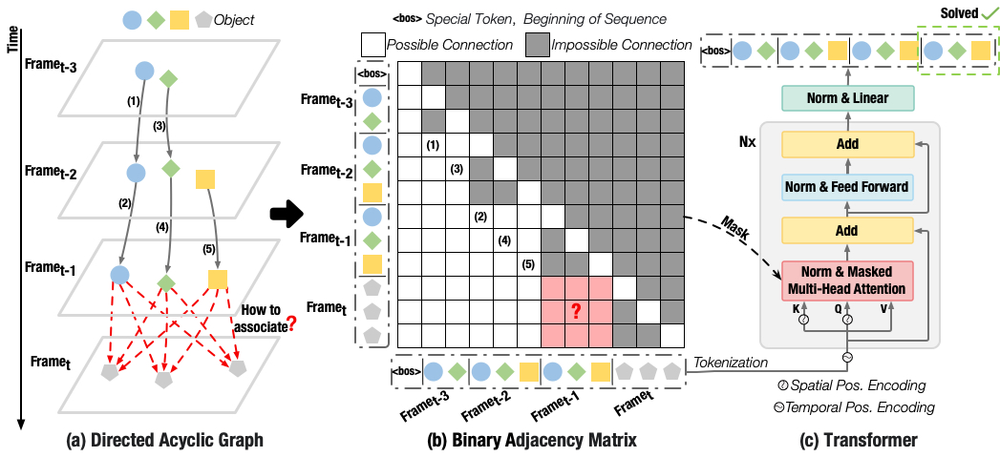

# Is a Pure Transformer Effective for Separated and Online Multi-Object Tracking? [[arXiv]](https://www.arxiv.org/abs/2405.14119)

## Abstract
Recent advances in Multi-Object Tracking (MOT) have demonstrated significant success in short-term association within the separated tracking-by-detection online paradigm. However, long-term tracking remains challenging. While graph-based approaches address this by modeling trajectories as global graphs, these methods are unsuitable for real-time applications due to their non-online nature.
In this paper, we review the concept of trajectory graphs and propose a novel perspective by representing them as directed acyclic graphs. This representation can be described using frame-ordered object sequences and binary adjacency matrices. We observe that this structure naturally aligns with Transformer attention mechanisms, enabling us to model the association problem using a classic Transformer architecture. Based on this insight, we introduce a concise Pure Transformer (PuTR) to validate the effectiveness of Transformer in unifying short- and long-term tracking for separated online MOT.
Extensive experiments on four diverse datasets (SportsMOT, DanceTrack, MOT17, and MOT20) demonstrate that PuTR effectively establishes a solid baseline compared to existing foundational online methods while exhibiting superior domain adaptation capabilities. Furthermore, the separated nature enables efficient training and inference, making it suitable for practical applications.


## Installation

```shell
conda create -n PuTR python=3.10  # create a virtual env
conda activate PuTR               # activate the env
conda install pytorch torchvision torchaudio pytorch-cuda=11.8 -c pytorch -c nvidia
# The PyTorch version must be greater than 2.0.
conda install matplotlib pyyaml scipy tqdm tensorboard
pip install opencv-python lap
```

## Data
Download [DanceTrack](https://dancetrack.github.io/), [SportsMOT](https://github.com/MCG-NJU/SportsMOT)
, [MOT17](https://motchallenge.net/data/MOT17/), and [MOT20](https://motchallenge.net/data/MOT20/) datasets and [detections](https://www.dropbox.com/scl/fi/usaoubca5to6jyd6e3a57/datasets.zip?rlkey=yoyf3e6aqsea06p4sotvq8mng&st=19cdokxy&dl=0). In addition, prepare seqmaps to run evaluation (for details see [TrackEval](https://github.com/JonathonLuiten/TrackEval)). Overall, the expected folder structure is: 

```
DATA_ROOT/
  ├── DanceTrack/
  │ ├── train/
  │ ├── val/
  │ ├── test/
  │ └── val_seqmap.txt
  │
  ├── SportsMOT/
  │ ├── train/
  │ ├── val/
  │ ├── test/
  │ └── val_seqmap.txt
  │
  ├── MOT17/
  │ ├── train/
  │ └── test/
  │
  └── MOT20/
    ├── train/
    └── test/
```

## Training
Training PuTR only needs a single GPU (recommended to use GPU with >= 24 GB Memory, like RTX 4090 or some else).

For example, to train on DanceTrack:
```shell
python main.py --config-path ./configs/train_dancetrack_putr.yaml --data-root <your data dir path>
```
To train on other datasets, you can replace the `--config-path` in the above command. E.g., from `./configs/train_dancetrack_putr.yaml` to `./configs/train_sportsmot_putr.yaml` for training on SportsMOT, `./configs/train_mot17_putr.yaml` for training on MOT17, or `./configs/train_mot20_putr.yaml` for training on MOT20.

## Inference
You can use this script to evaluate the trained model on the DanceTrack test set:
```shell
python main.py --config-path ./configs/eval_dancetrack_putr.yaml --data-root <your data dir path> --submit-model <filename of the checkpoint> --submit-data-split test
```
If you want to evaluate the model on the validation set, you can replace `test` with `val`.

To test on other datasets, you can replace the `--config-path` in the above command. E.g., from `./configs/eval_dancetrack_putr.yaml` to `./configs/eval_sportsmot_putr.yaml` for testing on SportsMOT, `./configs/eval_mot17_putr.yaml` for testing on MOT17, `./configs/eval_mot20_putr.yaml` for testing on MOT20.

You can download our [models](https://www.dropbox.com/scl/fi/o4hke0vg0rj20fch4me8b/weights.zip?rlkey=05m7avkq7ilqttjzgchkbcsvo&st=him8jq78&dl=0) to reproduce the results in the paper.

## Results

### Multi-Object Tracking on the DanceTrack test set


| Methods   | HOTA | MOTA   | IDF1 | DetA | AssA |
| --------- |------|--------|------|------|------|
| PuTR      | 60.6 | 92.3   | 61.7 | 82.6 | 44.6 |


### Multi-Object Tracking on the SportsMOT test set
*Train+Val and Train are the different detection results from YOLOX, and the results are obtained by the [official weights](https://github.com/MCG-NJU/MixSort).*


| Methods   | HOTA | MOTA   | IDF1 | DetA | AssA |   
| --------- |------|--------|------|------|------|   
| PuTR (Train+Val)     | 76.0 | 97.1   | 77.1 | 89.3 | 64.8 |
| PuTR (Train)     |  74.3 | 95.2   | 75.7 | 87.2 | 63.4 |   
### Multi-Object Tracking on the MOT17 test set

  | Methods   | HOTA | MOTA   | IDF1 | DetA | AssA |  
  | --------- |------|--------|------|------|------|  
  | PuTR      | 62.1 | 78.8   | 75.6 | 64.0 | 60.5 |  

### Multi-Object Tracking on the MOT20 test set

                                                     
| Methods   | HOTA | MOTA | IDF1 | DetA | AssA |   
| --------- |------|------|------|------|------|   
| PuTR      | 61.4 | 75.6 | 74.6 | 62.7 | 60.4 |   

## Citation


```bibtex


@article{liu2024putr,
  title={Is a Pure Transformer Effective for Separated and Online Multi-Object Tracking?},
  author={Liu, Chongwei and Li, Haojie and Wang, Zhihui and Xu, Rui},
  journal={arXiv preprint arXiv:2405.14119},
  year={2025}
}


```
## Acknowledgement
- [MeMOTR](https://github.com/MCG-NJU/MeMOTR)
- [TrackEval](https://github.com/JonathonLuiten/TrackEval)
- [MixSort](https://github.com/MCG-NJU/MixSort)
- [YOLOX](https://github.com/Megvii-BaseDetection/YOLOX)

